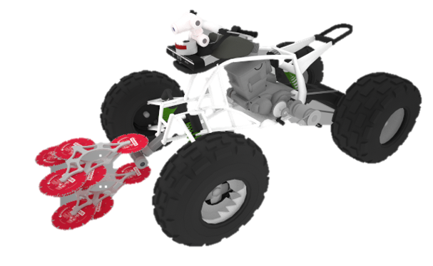

# soma_ros_pkg
林研究室 林業用ロボット"SOMA"のROSパッケージ



## 外部パッケージ要求(Requirement)  
* velodyne : velodyne社製LiDARを扱うパッケージ  
* realsense-ros : R200,D435,D435iを扱うパッケージ  
* xsens_driver : xsensのIMUを扱うパッケージ  
* nmea_navsat_driver : USB接続のGPSを扱うパッケージ  
* costmap_2d : 二次元コストマップを扱うパッケージ
* dwa_local_planner : DWAによる局所動作計画を行なうためのパッケージ
* navfn : ナビゲーション用の基礎パッケージ
* jsk_rviz_plugins : rvizに対応した便利なGUIプラグイン集

* hdl_graph_slam : LiDARに対応した３次元slamパッケージ  

## 外部パッケージ導入(Installation)
* __velodyne__  
http://wiki.ros.org/velodyne  

for kinetic  
```
sudo apt install ros-kinetic-velodyne
```
for melodic  
```
sudo apt install ros-melodic-velodyne
```

* __realsense-ros__  
https://github.com/IntelRealSense/realsense-ros#installation-instructions  

for kinetic  
```
sudo apt install ros-kinetic-realsense2-camera
```
for melodic  
```
sudo apt install ros-melodic-realsense2-camera
```

* __nmea_navsat_driver__  
http://wiki.ros.org/nmea_navsat_driver  

```
sudo apt install ros-kinetic-nmea-navsat-driver
```
```
sudo apt install ros-melodic-nmea-navsat-driver
```

* __xsens_driver__  
http://wiki.ros.org/xsens_driver  

catkin_wsにソースコードをダウンロードしてcatkin_makeする  
```
cd catkin_ws/src
git clone https://github.com/ethz-asl/ethzasl_xsens_driver
cd ~/catkin_ws
catkin_make
```

* __costmap_2d__  
```
sudo apt install ros-kinetic-costmap-2d
```
```
sudo apt install ros-melodic-costmap-2d
```

* __dwa_local_planner__  
```
sudo apt install ros-kinetic-dwa-local-planner
```
```
sudo apt install ros-melodic-dwa-local-planner
```

* __navfn__  
```
sudo apt install ros-kinetic-navfn
```
```
sudo apt install ros-melodic-navfn
```

* __jsk_rviz_plugins__  
```
sudo apt install ros-melodic-jsk-rviz-plugins
```


* __hdl_graph_slam__  
https://github.com/koide3/hdl_graph_slam  

catkin_wsにソースコードをダウンロードしてcatkin_makeする  
HDL Graph SLAMに必要なパッケージもインストールする必要がある  

for kinetic
```
sudo apt-get install ros-kinetic-geodesy ros-kinetic-pcl-ros ros-kinetic-nmea-msgs ros-kinetic-libg2o
```
for melodic
```
sudo apt-get install ros-melodic-geodesy ros-melodic-pcl-ros ros-melodic-nmea-msgs ros-melodic-libg2o
```

```
cd catkin_ws/src
git clone https://github.com/koide3/ndt_omp.git
git clone https://github.com/koide3/hdl_graph_slam.git
cd ~/catkin_ws
catkin_make
```


## パッケージ構成(Structure)
soma_ros_pkg:
* soma_motion_planner:
* soma_sensor:
* soma_perception:
* soma_ros:
* soma_smpls:


# 実行方法等(How to run)
## センサノード起動
* RGB-Dカメラ  
	* 単体起動 シリアル番号の指定なし
```
roslaunch soma_sensor rgbd_camera.launch
```
	* 前方，後方カメラ起動
```
roslaunch soma_sensor rgbd_camera_F.launch
roslaunch soma_sensor rgbd_camera_B.launch
```

